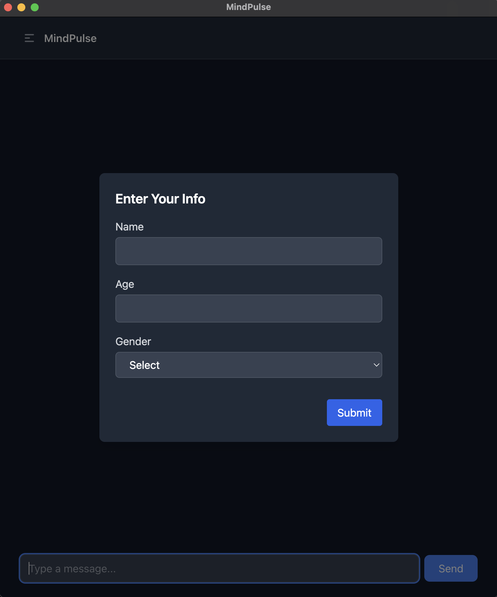
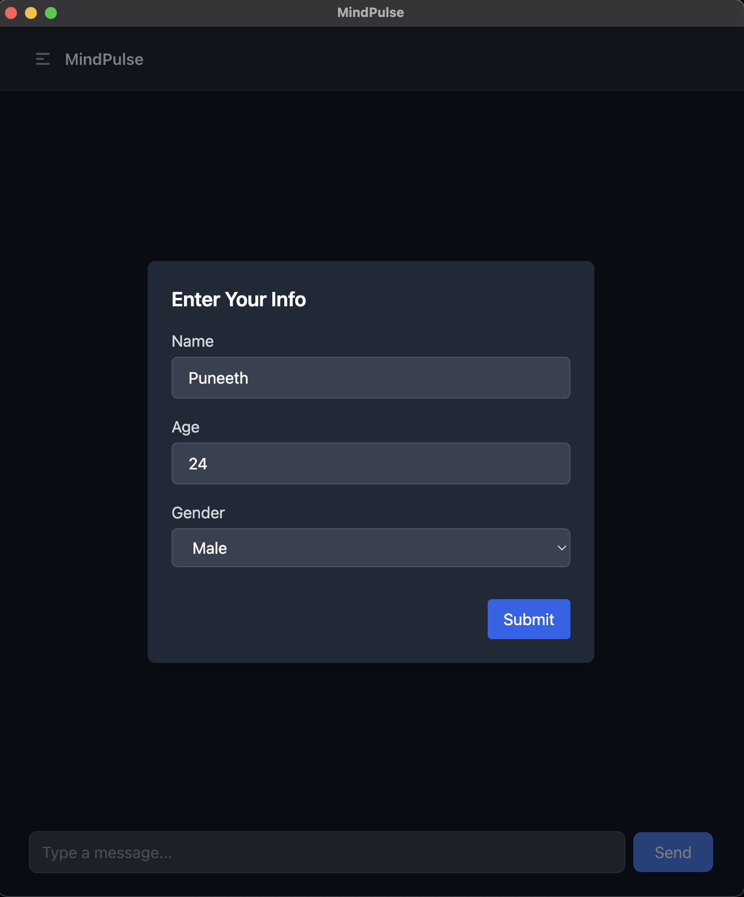
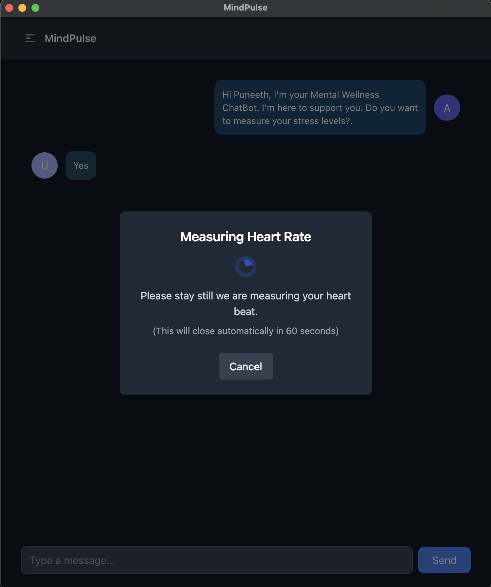
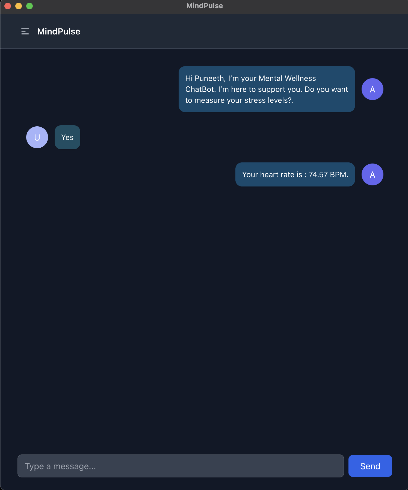
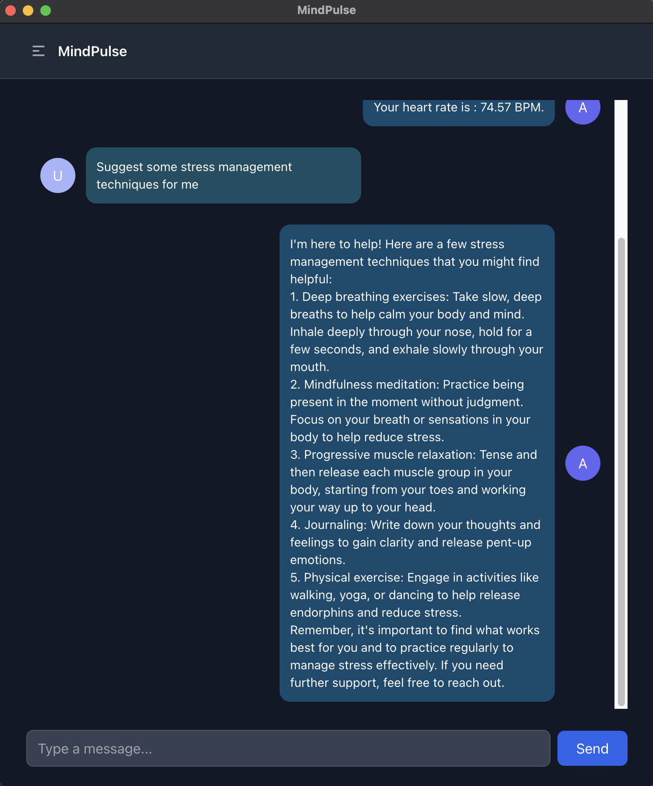
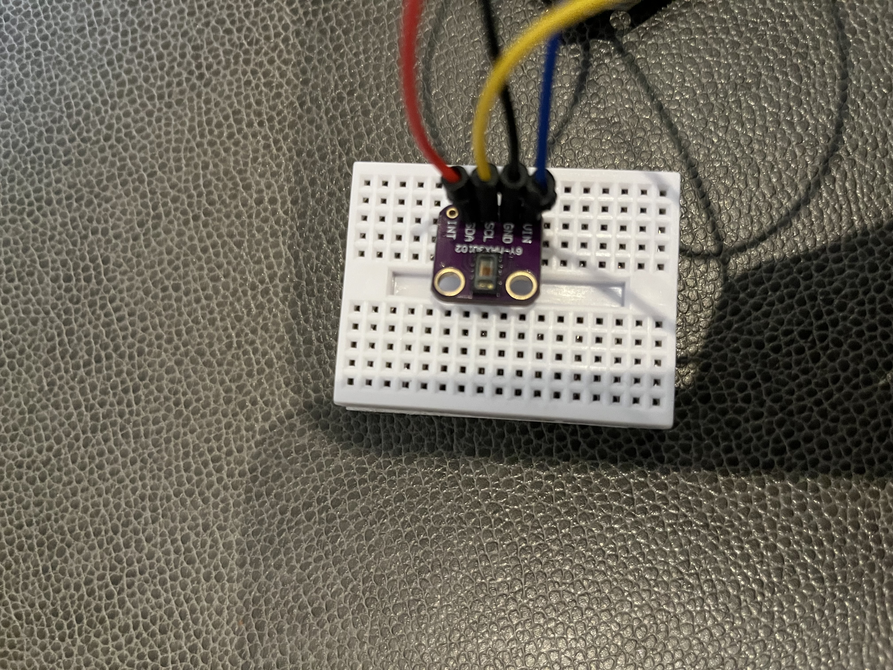

# MindPulse

**MindPulse** is an AI-powered wellness assistant designed to help people navigate moments of stress and anxiety. In a world that moves fast and demands a lot, MindPulse offers a moment of calm — listening, engaging, and understanding, like a friend who’s always there.


---

## 💡 Overview

In today's high-pressure environment, **stress is inevitable** — but support shouldn't be. MindPulse combines intelligent conversation with real-time physiological monitoring to provide an empathetic, interactive wellness experience.


<h3>🔄 Application Flow</h3>

<table>
  <tr>
    <td></td>
    <td></td>
    <td></td>
  </tr>
  <tr>
    <td align="center">Desktop Application</td>
    <td align="center">Enter User Details</td>
    <td align="center">Start your heart beat measurement</td>
  </tr>
  <tr>
    <td></td>
    <td></td>
    <td></td>
    <td></td>
  </tr>
  <tr>
    <td align="center">Application shows your heart beat</td>
    <td align="center">AI gives you some advice to reduce stress</td>
    <td align="center">MAX30102 sensor connected to Aurdino Uno</td>
    <td></td>
  </tr>
</table>


### ✨ Key Features

- 💬 **AI Chatbot** – Chat with an AI trained for empathetic, stress-relieving conversation
- ❤️ **Heart Rate Monitoring** – Integrated with a MAX30102 heart rate sensor
- 📊 **Stress Detection** – Analyzes BPM data to determine possible stress levels
- 🔄 **Real-Time Feedback** – Instantly respond to elevated stress states with guided conversation or suggestions
- 🌐 **Desktop-Based Interface** – Simple Desktop App that connects to the backend API

---

## 🧪 Tech Stack

| Component       | Technology           |
|----------------|----------------------|
| Frontend        | ElectronJS (ReactJS, JavaScript) |
| Backend         | ASP.NET Core (C# API) |
| Hardware        | Arduino + MAX30102 Sensor |
| Serial Communication | System.IO.Ports |
| AI Assistant    | OpenAI API |
| Heart Rate Logic | Arduino + SparkFun Lib |

---

## 🛠️ How It Works

1. User interacts with MindPulse through a chat interface.
2. Heart rate is monitored in real-time via the MAX30102 sensor.
3. Arduino calculates BPM and sends it to the backend API.
4. Backend determines stress based on heart rate and shares it with the chatbot.
5. Chatbot adapts its responses based on stress state (e.g., calming tone, breathing exercises, etc.).

---

## 🚀 Getting Started

### 🔌 Hardware Setup

1. Connect MAX30102 to Arduino via I2C:
   - **VCC → 3.3V/5V**
   - **GND → GND**
   - **SDA → A4 (on Uno)**
   - **SCL → A5 (on Uno)**

2. Flash Arduino code using the SparkFun MAX3010x library.

<h3>Hardware Setup</h3>

<table>
  <tr>
    <td></td>
  </tr>
  <tr>
    <td align="center">MAX30102 Heart Rate Sensor</td>
  </tr>
</table>


## 🚀 Running the Frontend (Electron + ReactJS)

This project uses **ElectronJS** for building a desktop application with a **ReactJS** frontend.

### 🧰 Prerequisites

- [Node.js & npm](https://nodejs.org/) installed
- Code editor (e.g., VS Code)

---

From the project root directory, run:

```bash
cd client
npm install
npm start
```

Then, in another terminal window from the project root:
```bash
npm run electron
```


### 🖥️ Backend (ASP.NET API)


### 📂 Folder Structure
    .
    ├── Controllers/
    │   ├── ChatController.cs                # Handles AI chat-related endpoints
    │   └── HeartRateController.cs           # Handles heart rate monitoring endpoints
    ├── Models/
    │   ├── ChatRequest.cs              # Model representing the incoming chat request
    │   └── ChatResponse.cs             # Model representing the response from the AI
    ├── obj/                                 # Build artifacts (auto-generated)

    ├── Properties/
    │   └── launchSettings.json          # Local launch profiles for debugging
    ├── Services/
    │   ├── HeartRateService.cs          # Calculates stress level from heart rate
    │   ├── IOpenAiChatService.cs        # Interface for OpenAI chat service
    │   └── OpenAiChatService.cs         # Implements OpenAI chat functionality
    ├── appsettings.Development.json     # Environment-specific config for development
    ├── appsettings.json                 # Base application configuration
    ├── Program.cs                       # Entry point of the ASP.NET Core app
    ├── server.csproj               # Project file defining dependencies and build config
    ├── server.http                              # Test API endpoints with HTTP requests
    └── README.md                                # Project documentation

### Prerequisites

- [.NET 7+ SDK](https://dotnet.microsoft.com/en-us/download)

### Configuration
Update your `appsettings.json` or `appsettings.Development.json`:

```bash
{
  "OpenAi": {
    "ApiKey": "your-openai-api-key"
  }
}
```

### Run the App

```bash
dotnet restore
dotnet run
```
